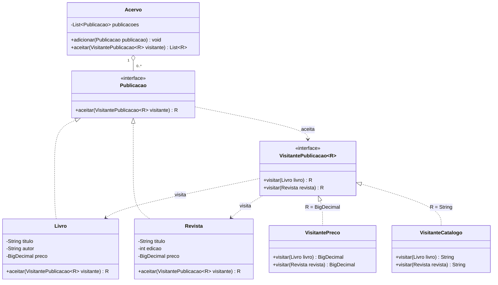

#

```mermaid
classDiagram
    class Publicacao {
        <<interface>>
        +aceitar(VisitantePublicacao~R~ visitante) R
    }
    class Livro {
        -String titulo
        -String autor
        -BigDecimal preco
        +aceitar(VisitantePublicacao~R~ visitante) R
    }
    class Revista {
        -String titulo
        -int edicao
        -BigDecimal preco
        +aceitar(VisitantePublicacao~R~ visitante) R
    }
    class VisitantePublicacao~R~ {
        <<interface>>
        +visitar(Livro livro) R
        +visitar(Revista revista) R
    }
    class VisitantePreco {
        +visitar(Livro livro) BigDecimal
        +visitar(Revista revista) BigDecimal
    }
    class VisitanteCatalogo {
        +visitar(Livro livro) String
        +visitar(Revista revista) String
    }
    class Acervo {
        -List~Publicacao~ publicacoes
        +adicionar(Publicacao publicacao) void
        +aceitar(VisitantePublicacao~R~ visitante) List~R~
    }

    Publicacao <|.. Livro
    Publicacao <|.. Revista
    VisitantePublicacao~R~ <|.. VisitantePreco : R = BigDecimal
    VisitantePublicacao~R~ <|.. VisitanteCatalogo : R = String
    Acervo "1" o-- "0..*" Publicacao
    Publicacao ..> VisitantePublicacao~R~ : aceita
    VisitantePublicacao~R~ ..> Livro : visita
    VisitantePublicacao~R~ ..> Revista : visita
```
